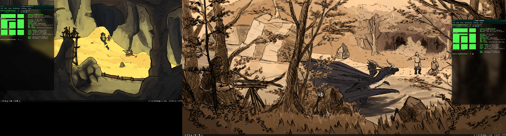

# Has this ever happened to you?

You just spent some mad flex money on a high PPI monitor and want to karmawhore the fuck out of your setup on /r/unixporn¹. You open not one, but ***two*** console windows with screenfetch inside, just so you can flex your 2080ti on poor peasants that can't afford computers capable of running anything other but some puny tiling WM. Because you also want to show your vastly superior desktop background (which can be either your waifu, game concept art, a photo nixed off 500px, artwork stolen off deviantART or something that you yourself made — despite the fact that you can neither draw nor take photos for shit)², you position the terminals at the very edge of your screens. Then you press 'print screen' and expect to get something like this:

But then you remember that you've rebound your print screen key to `spectacle --region` because that's what you want most of the time. This should be fi— of course not, the entire screen shifts to the left and moves the left screenfetch off screen, single-handedly ruining your dreams of getting /r/unixporn's "top post of all time" spot. Half of the left monitor is cut off, including your precious wallpaper and screenfetch. As you see the disaster unfold before your very eyes, one last glimmer of hope still remains. "Maybe I can select the second screenfetch on the right, along with a lil bit of extra desktop to compensate," you think to yourself whi— Nope. you can't do that either. You can't select the second screenfetch. Your world now lies in ruins.

So you go on the internet, straight to ~~the KDE bugtracker and start scre—~~ nope, you go straight to github, clone this repo and compile this shit (`gcc -lX11 gsof.c -o gsof`) (or download the x64 build from 'releases' page, which may or may not work). Then you move the compiled binary somewhere safe and throw it in your startup programs and hope Tamius plugged all the memory leaks because he generally can't write a C program for shit, even when if his life depended on it². If there's memory leaks, then nice — I'll gladly accept the graditudes, but I'll also settle for stars.

----

¹This setup is more like /r/shittyunixporn but you get the gist 
²I don't know why do I feel the need to personally attack myself like this on my own github but hey
